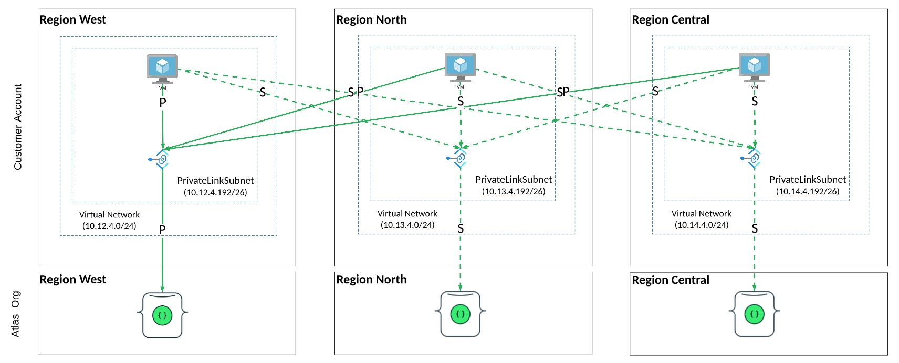

# MongoDB Atlas project private endpoint into Azure VNet 

## Background
Based on a request of long standing Atlas customer, who wished to create a Multi Region cluster.
Although provisioning a Multi Region cluster is simple, the devil is in the details around networking.
Not so much the Atlas networking as the well as the Azure Multi Region setup to take full advantage 
of HA in case of regional failures. 

This setup cretes a MongoDB Multi region cluster, including an Private Endpoint per region.
At the Azure side 3 virtual machines are created, each in an Azure Region. 
Next the Virtual networks are wired together with VNet peering.

This script automates all steps. 
The documentation on how to do this manually: https://docs.atlas.mongodb.com/security-private-endpoint 

The end result of the Terraform script is a project in Atlas + a Muli Region Cluster + provisioned user, private linked to 3 Azure Region with 3 VM with public interface (ssh/key). The vm has already MongoDB client tools installed.



## Prerequisites:
* Authenticate into Azure via CLI with:  az login
* Have Terraform >= 1.0 installed
* Run: terraform init 

```
Initializing provider plugins...
- Checking for available provider plugins...
- Downloading plugin for provider "azurerm" (hashicorp/azurerm) 2.45.0...
- Downloading plugin for provider "mongodbatlas" (terraform-providers/mongodbatlas) 1.4.4
```

## Config:
* Set up credential, as in section: "Configure Script - Credentials"
* Change basic parameters, as in file : locals.tf
* Run: terraform apply

## Todo:
* Test with terrafrom 14. 

## Basic Terraform Modules in script
* atlas
* azure
* networking
  
## Atlas Module
* mongodbatlas_project,  creates an empty project in your Atlas account
* mongodbatlas_advanced_cluster, MultiRegion cluster 
* Create User

## Azure Module
* azurerm_resource_group, create a Azure resource group to hold vnet and other resources
* azurerm_virtual_network, create a Azure Virtual Network to peer int
* azurerm_subnet, 
* azurerm_public_ip,
* azurerm_network_security_group,
* azurerm_network_interface,
* azurerm_network_interface_security_group_association,
* azurerm_linux_virtual_machine

## Networking
* mongodbatlas_privatelink_endpoint, create privatelink endpoint
* mongodbatlas_privatelink_endpoint_service, create private link service in Atlas
* azurerm_private_endpoint, creates the endpoint in Azure
* azurerm_virtual_network_peering, to other 2 regions

 
## Configure Script - Credentials: "variables.tf"

To configure the providers, such as Atlas and Azure, one needs credentials to gain access.
In case of MongoDB Atlas a public and private key pair is required. 
How to create an API key pair for an existing Atlas organization can be found here:
https://docs.atlas.mongodb.com/configure-api-access/#programmatic-api-keys
These keys are read in environment variables for safety. Alternatively these parameters
can be provide on the command line of the terraform invocation. The MONGODBATLAS provider will read
the 2 distinct variable, as below:

* MONGODB_ATLAS_PUBLIC_KEY=<PUBLICKEY>
* MONGODB_ATLAS_PRIVATE_KEY=<PRIVATEKEY>

Second a Azure subscription is required.  The primary attributes are also expected 
as environment variables. Values need to be provided in TF_VAR_ format.

* TF_VAR_azure_subscription_id=<SUBSCRIPTION_ID>
* TF_VAR_azure_tenant_id=<DIRECTORY_ID>

Third there are several other parameters that are trusted, which should be provided via environment variables.
```
variable "atlas_organization_id" {
  description = "Atlas organization id where to create project & link & project"
  type = string
}

variable "azure_subscription_id" {
  description = "Azure subscription for peering with ..."
  type = string
}

variable "azure_tenant_id" {
  description = "Azure subscription Directory ID"
  type = string
}

variable "public_key_path" {
  description = "Access path to public key"
  type = string
}

variable "private_key_path" {
  description = "Access path to private key"
  type = string
}

variable "admin_password" {
  description = "Generic password for demo resources"
  type = string
}

variable "source_ip" {
  description = "Limit vm access to this ip_address"
  type = string
}

```

## Other configuration: "locals.tf"

In the locals resource of the locals.tf file, several parameters should be adapted to your needs
```
locals {
  # New empty Atlas project name to create in organization
  project_name          = "Multi-Region-Azure-Linked-Project"
  # Atlas region, https://docs.atlas.mongodb.com/reference/microsoft-azure/#microsoft-azure
  region                = "EUROPE_WEST"
  # Atlas cluster name
  cluster_name		      = "Sample-MultiRegion01"
  # Atlas Public providor
  provider_name         = "AZURE"
  # Provider Region
  provider_region1       = "westeurope"
  # Provider Region
  provider_region2       = "northeurope"
  # Provider Region
  provider_region3       = "germanywestcentral"
  


  # A Azure resource group
  resource_group_name1   = "atlas-demo-link-west"
  # A Azure resource group
  resource_group_name2   = "atlas-demo-link-north"
  # A Azure resource group
  resource_group_name3   = "atlas-demo-link-central"
  # Associated Azure vnet
  vnet_name1             = "atlas-link-vnet-west"
  # Associated Azure vnet
  vnet_name2             = "atlas-link-vnet-north"
  # Associated Azure vnet
  vnet_name3             = "atlas-link-vnet-central"
  # Azure location
  location1              = "West Europe"
  # Azure location
  location2              = "North Europe"
  # Azure location
  location3              = "Germanywest central"
  
  # Azure cidr block for vnet
  address_space1         = ["10.12.4.0/23"]
  # Azure cidr block for vnet
  address_space2         = ["10.13.4.0/23"]
  # Azure cidr block for vnet
  address_space3         = ["10.14.4.0/23"]
  # Azure subnet in vnet
  subnet1                = "subnet1"
  # Azure subnet in vnet
  subnet2                = "subnet2"
  # Azure subnet in vnet
  subnet3                = "subnet3"
  # Azure subnet cidr
  subnet_address_space1  = "10.12.4.192/26"
  # Azure subnet cidr
  subnet_address_space2  = "10.13.4.192/26"
  # Azure subnet cidr
  subnet_address_space3  = "10.14.4.192/26"
  # Azure vm admin_user
  admin_username        = "testuser"
  # Azure vm size
  azure_vm_size		      = "Standard_F2"
  # Azure vm_name	
  azure_vm_name1		      = "demo-link-west"
  # Azure vm_name	
  azure_vm_name2		      = "demo-link-north"
  # Azure vm_name	
  azure_vm_name3		      = "demo-link-central"
}
 
```


## Give a go

In you favorite shell, run terraform apply and review the execution plan on what will be added, changed and detroyed. Acknowledge by typing: yes 

```
%>  terraform apply
```

Your final result should look like:
```
Apply complete! Resources: 42 added, 0 changed, 0 destroyed.

Outputs:

atlasclusterstring = "mongodb://sample-multiregion01-shard-00-00.biyis.mongodb.net:27017,sample-multiregion01-shard-00-01.biyis.mongodb.net:27017,sample-multiregion01-shard-00-02.biyis.mongodb.net:27017/?ssl=true&authSource=admin&replicaSet=atlas-jyc5zb-shard-0"
public_ip_address1 = [
  "41.114.47.3",
]
public_ip_address2 = [
  "41.126.143.252",
]
public_ip_address3 = [
  "21.51.177.34",
]
user1 = "testuser"

```

## Now login, if you have your ssh keys properly configured:
```
>$ ssh testuser@41.114.47.3"
...
Last login: Mon Sep 4 09:47:34 2021 from **************************
testuser@demo-link:~$ mongo mongodb+srv://sample-multiregion01.biyis.mongodb.net --username testuser
MongoDB shell version v6.0.1
Enter password: 
connecting to: mongodb://sample-multiregion01-shard-00-00.biyis.mongodb.net:27017,sample-multiregion01-shard-00-01.biyis.mongodb.net:27017,sample-multiregion01-shard-00-02.biyis.mongodb.net:27017/?ssl=true&authSource=admin&replicaSet=atlas-jyc5zb-shard-0
Implicit session: session { "id" : UUID("8ee43f82-3da4-41c7-a36a-3baf93ca7464") }
MongoDB server version: 6.0.10
WARNING: shell and server versions do not match
MongoDB Enterprise atlas-zmjsri-shard-0:PRIMARY> 
```
 
## Known Bugs
* let me know
